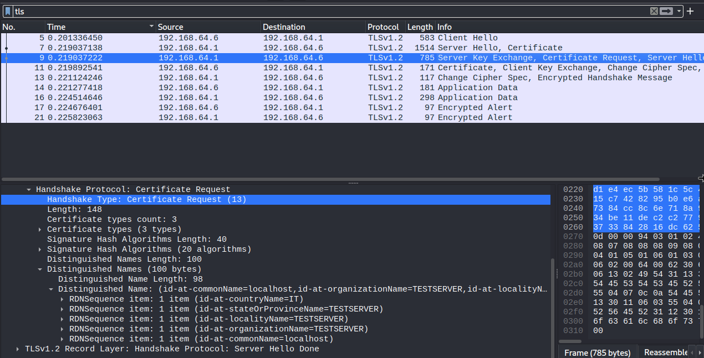
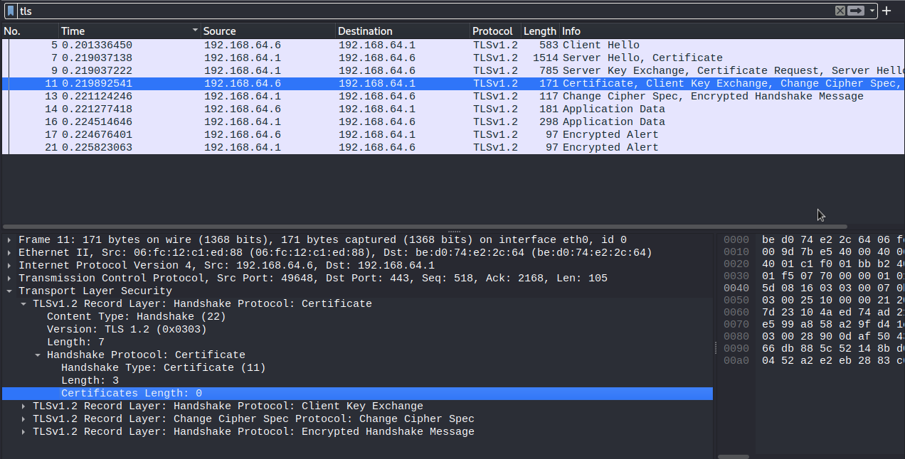
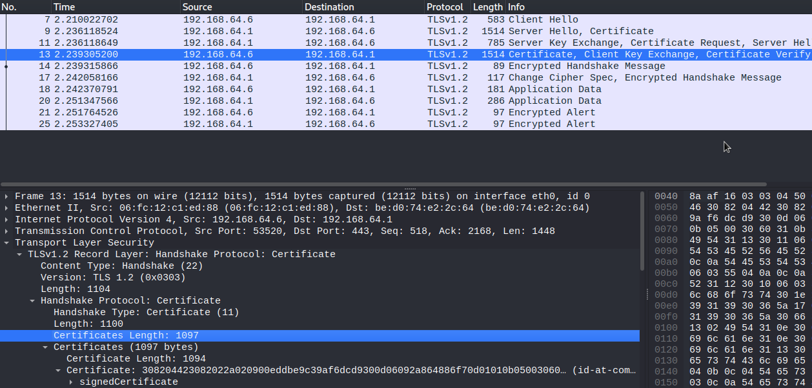
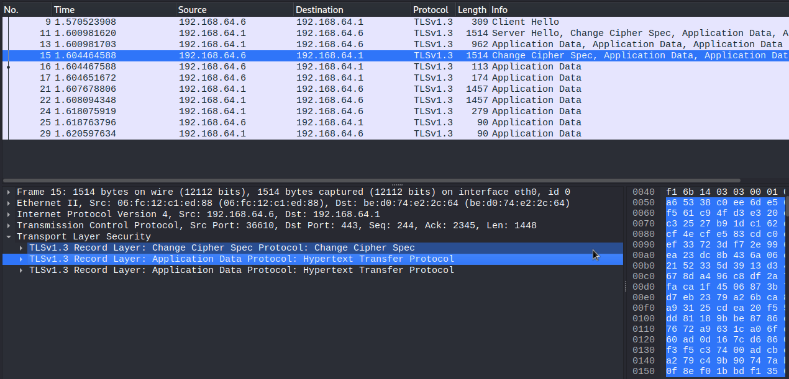

Transport Layer Security (TLS) is a widely used cryptographic protocol for securing communications over the internet. TLS provides encryption and authentication services that protect data in transit between client and server applications. Mutual Transport Layer Security (MTLS) is an extension of TLS that provides two-way authentication between client and server applications. In mTLS, both the client and server present their digital certificates to each other and verify each other's identity before establishing a secure communication channel.

When working with mTLS connections, it is important to be able to debug the handshake process to identify and resolve issues with certificate validation, key exchange, and other cryptographic protocols. Wireshark is a powerful tool that can be used to capture, analyze, and debug network traffic, including TLS and mTLS connections.

This article will discuss how to use Wireshark to debug mTLS connections, capture traffic and analyze the TLS handshake process.
This can be useful for checking if the client doesn't send the correct certificate.

> After the handshake, in TLS 1.3, the packets are encrypted, so getting them in plain text is impossible. We will see this in more detail at the end of this article.

## Creating a Server with mTLS

For our testing purposes, we create an elementary mTLS server in PHP.
You can find the full source code here: https://github.com/marco-introini/mtls-example
First, we must configure the Apache server to use our generated certificates. This can be done in the configuration file:

```
SSLEngine on  
SSLCertificateFile /etc/apache2/ssl/ssl.crt
SSLCertificateKeyFile /etc/apache2/ssl/ssl.key
```

Then, in the same configuration file, we accept the client certificate but do not force it:

```
SSLVerifyClient optional
SSLVerifyDepth 1
SSLOptions +StdEnvVars
SSLCACertificateFile /etc/apache2/ssl/ssl.crt
```

It's crucial to add `SSLOptions +StdEnvVars` because we can check the certificate using Superglobals.

The server PHP code is very simple: it checks if the client used an actual certificate and prints its Common Name

```php
if ($_SERVER['SSL_CLIENT_VERIFY'] != 'SUCCESS') {
	die('SSL client verification failed');
}
  
echo "Welcome ".$_SERVER["SSL_CLIENT_S_DN_CN"];
```

## Creating a Client with mTLS

There is no need to create a client: we can simply use curl or OpenSSL

With curl, we can use:

```bash
curl --location 'https://localhost/server.php' \
--key "./certs/client_key.pem" \  
-E "./certs/client_cert.pem" \  
--cacert "./certs/ssl.crt"
```

In OpenSSL:

```bash
openssl s_client -connect localhost:443 -status -msg -key certs/client_key.pem -cert certs/client_cert.pem -CAfile certs/ssl.crt -state
```

Note that using OpenSSL we can check only the root of our server, not a single page like in curl.

## Testing

For having different IP for client and server machines I used a virtual machine with Kali Linux installed for the curl client and Wireshark and the macOS with docker desktop for the server.
In the following example, the client IP is 192.168.64.6 and the server IP is 192.168.64.1

Of course, we must copy all certificates inside the Kali Linux VM before using curl.
Because the server certificate is generated using localhost as CN we must add the -k option too.

#### Wireshark capture without client certificate

Let's begin with a client call without a client certificate. Open Wireshark and in a terminal write

```
curl --tlsv1.2 --tls-max 1.2 \
--location 'https://192.168.64.1/server.php' \
--cacert "/media/shared/ssl.crt" -k
```

Obviously, the curl fails.
```
SSL client verification failed 
```

Let's see what happened.
Firstly the client sent the Client Hello Message; the server response was a Server Hello, sending its own (server) certificate. Then the server sent another message requesting a client certificate (Certificate Request Message - Type 13):



The client has not a certificate, so its response is without it, as you can see from the following capture



#### Wireshark capture with client certificate

Now let's try it again, but using the correct client certificate

```
curl --tlsv1.2 --tls-max 1.2 \
--location 'https://192.168.64.1/server.php' \
--key "/media/shared/client_key.pem" \
-E "/media/shared/client_cert.pem" \
--cacert "/media/shared/ssl.crt" -k
```

Response now is

```
Welcome TestClient
```

Let's dig inside Wireshark.
The Client Hello and Server Hello (including Certificate Request) is the same. But the client has sent the certificate this time, as it is evident that they possess one from this packet:



We can further analyze the certificate used:


#### The problem with TLS 1.3

We have seen the mTLS connection forcing the TLS version to 1.2. We did it because debugging a TLS 1.3 connection is way more challenging because everything after the Server Hello is encrypted.

Let's demonstrate it.
We can force the TLS 1.3 in the same curl call.
```
curl --tlsv1.3 --tls-max 1.3 \
--location 'https://192.168.64.1/server.php' \
--key "/media/shared/client_key.pem" \
-E "/media/shared/client_cert.pem" \
--cacert "/media/shared/ssl.crt" -k
Welcome TestClient   
```

Let's see what Wireshark can see:



In this packet, there is the Client Certificate request, as we saw in the 1.2 example, but this time the whole data are encrypted and unavailable to Wireshark.

## Conclusions

In conclusion, Transport Layer Security (TLS) and Mutual Transport Layer Security (mTLS) play crucial roles in securing communications over the Internet. Wireshark is a valuable tool for debugging mTLS connections, capturing network traffic, and analyzing the TLS handshake process. By using Wireshark, developers can identify and resolve issues related to certificate validation, key exchange, and other cryptographic protocols.

When establishing an mTLS connection, both the client and server exchange digital certificates to verify each other's identity, ensuring a secure communication channel. Wireshark allows us to observe the handshake process, providing insights into the exchange of certificates and other relevant information.

Through practical examples, this article demonstrated how to create an mTLS server and client using PHP, curl, and OpenSSL. Wireshark was then used to capture and analyze the network traffic between the server and the client. By examining the captured packets, we could observe the differences in behavior when a client certificate was present or absent.

It is important to note that debugging TLS 1.3 connections can be more challenging due to encryption. In TLS 1.3, after the Server Hello, the packets become encrypted, making it impossible for Wireshark to access the plaintext data. However, Wireshark can still provide valuable insights into the handshake process and the initial stages of communication.

Overall, Wireshark is a powerful tool for troubleshooting mTLS connections and gaining a deeper understanding of the TLS handshake. It allows developers to diagnose and resolve issues related to certificate verification and other aspects of secure communication, ultimately enhancing the security and reliability of Internet-based applications.